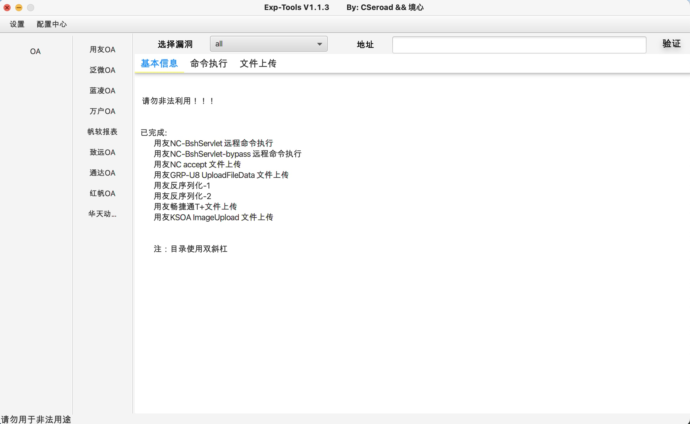

**本工具仅供安全测试人员运用于授权测试, 禁止用于未授权测试, 违者责任自负。**

## 简介
该工具使用了ExpDemo-JavaFX项目，保留了核心的数据包请求接口，使用jdk1.8环境开发。目前只编写了oa系列，对相关漏洞进行复现和分析，极力避免exp的误报和有效性。

截止到目前为止，已实现了用友、泛微、通达、致远、帆软报表、万户、蓝凌、红帆、华天动力总共9个OA。
全部是命令执行、文件上传类的漏洞，包括前台和后台，未编写log4j、fastjson相关漏洞。

用友已完成：
- 用友NC-BshServlet 远程命令执行
- 用友NC-BshServlet-bypass 远程命令执行
- 用友NC accept 文件上传
- 用友CRM swfupload 文件上传
- 用友GRP-U8 UploadFileData 文件上传
- 用友GRP-U8 AppProxy 文件上传
- 用友反序列化-1
- 用友反序列化-2
- 用友畅捷通T+文件上传
- 用友KSOA ImageUpload 文件上传
- 用友KSOA Attachment 文件写入

泛微已完成:
- 泛微OA KtreeUploadAction 文件上传
- 泛微OA uploaderOperate 文件上传
- 泛微OA weaver.common.Ctrl 文件上传
- 泛微eoffice OfficeServer 文件上传
- 泛微eoffice UploadFile 文件上传
- 泛微eoffice ajax 文件上传
- 泛微BshServlet 远程命令执行
- 泛微ecology前台sql注入-1
- 泛微ecology前台sql注入-2
- 泛微ecology FileClient 文件上传
- 泛微ecology后台风格文件上传
- 泛微ecology后台流程命令执行
- 泛微emobile client命令执行
- 泛微emobile messageType命令执行

蓝凌已完成:
- 蓝凌OA SSRF
- 蓝凌OA SSRF BeanShell 文件上传
- 蓝凌OA SSRF XmlDecoder 文件上传
- 蓝凌OA treexml 命令执行
- 蓝凌OA后台模板文件上传 

万户已完成:
- 万户OA fileUpload 文件上传
- 万户OA officeserverservlet 文件上传
- 万户OA smartUpload 文件上传
- 万户OA OfficeServer 文件上传

帆软已完成:
- 帆软报表任意文件读取
- 帆软报表任意文件覆盖
- 帆软报表后台插件文件上传
- 帆软报表后台主题文件上传

致远已完成:
- 致远session泄露processUpload文件上传
- 致远uploadMenuIcon文件上传
- 致远ajax文件上传
- 致远ajax文件上传-bypass
- 致远wpsAssistServlet文件上传
- 致远htmlofficeservlet文件上传
- 致远后台模板文件上传
- 致远后台模板管理器文件上传
- 致远帆软报表文件读取
- 致远帆软报表文件读取-bypass
- 致远帆软报表后台插件文件上传
- 致远帆软报表后台主题文件上传

通达已完成:
- 通达任意用户登录-1
- 通达任意用户登录-2
- 通达任意用户登录-3
- 通达任意用户登录-4
- 通达Ispirit文件上传
- 通达后台附件文件上传

红帆已完成:
- 红帆OA任意文件上传
- 红帆OA任意文件写入

华天动力已完成:
- 华天动力OA任意文件上传
## 使用说明
直接下载releases版本即可

**使用JDK8启动，命令如下：**

java -javaagent:Exp-Tools-1.2.0-encrypted.jar -jar Exp-Tools-1.2.0-encrypted.jar

## 更新日志

### 2023/1/2

- 新增红帆OA任意文件上传
- 新增华天动力OA任意文件上传

### 2023/2/1

- 新增泛微ecology FileClient 文件上传
- 新增泛微ecology后台流程命令执行
- 默认上传文件修改为json.txt

### 2023/2/28

- 修复通达oa后台附件文件上传一处bug

### 2023/3/1

- 新增YongyouNC反序列化

### 2023/3/17

- 新增Yongyou-U8 AppProxy 文件上传
- 新增用友KSOA Attachment 文件写入
- 新增致远后台模板管理器文件上传
- 修复多个bug

### 2023/4/6

- 新增蓝凌oa后台模板上传
- 新增用友CRM swfupload 文件上传
- 修复cookie 更新
- 优化部分代码
- 修复多个bug

### 2023/4/27
- 新增泛微ecology前台sql注入-2
- 新增红帆OA任意文件写入
- 修复泛微emobile一处bug
- 删除泛微ecology后台皮肤文件上传
- 删除conf文件夹，修改为启动时创建
- 删除cookie提示

### 2023/6/28
- 新增用友畅捷通T+SQL注入
- 新增致远帆软报表文件读取-bypass
- 新增泛微eoffice uploadify上传
- 新增php-framework和java-framework
- 新增nacos任意用户添加
- 新增金蝶云星空反序列化
- 优化部分代码

## 参考链接
https://github.com/White-hua/Apt_t00ls

https://github.com/xinyu2428/TDOA_RCE

https://github.com/yhy0/ExpDemo-JavaFX

https://github.com/0x727/DropLabTools

https://github.com/xinyu2428/TDOA_RCE

https://github.com/Ghost2097221/YongyouNC-Unserialize-Tools
## 问题建议
如果使用过程出现误报、漏报、未添加的exp以及更好的建议，欢迎师傅们提交issues

## Stargazers over time

